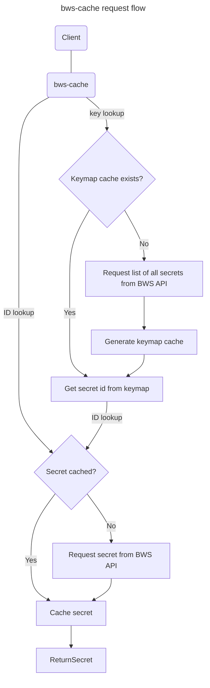

# Bitwarden Secrets Manager Cache

Python app implementing a read-through cache for Bitwarden Secrets Manager (BWS) secrets.

# Usage

When a secret is queried, not only is the secret cached in memory, but a mapping between ID and key is also cached.

This allows lookup by either ID or key, as shown below.

## Endpoints

* `/id/<string:secret_id>`
* `/key/<string:secret_key>`
* `/reset`

## Authentication

bws-cache delegates authentication to the BWS client library, rather than requiring a defined token for client authentication.

A valid BWS access token should be passed as a bearer token in the `Authorization` header, as shown in the examples below.

## Examples

Query secret by ID: `curl -H "Authorization: Bearer <BWS token>" http://localhost:5000/id/<secret_id>`

Query secret by key: `curl -H "Authorization: Bearer <BWS token>" http://localhost:5000/key/my_secret`

Invalidate the secret cache: `curl -H "Authorization: Bearer <BWS token>" http://localhost:5000/reset`

# Run

You can get your BWS organisation ID two ways:
* From BWS CLI:
  * `bws project list` / `bws project get <project_id>` - Your organisation ID is shown in the `organizationId` value of each project returned.
  * `bws secret list` / `bws secret get <secret_id>` - Your organisation ID is shown in the `organizationId` value of each secret returned.
* From browser:
  1. Go to https://vault.bitwarden.com
  2. Open Secrets Manager from the apps list in the top right
  3. Your organisation ID is in the URL like this: `https://vault.bitwarden.com/#/sm/<BWS org ID>`

Docker Run:

```
docker run \
  -p 5000:5000 \
  -e ORG_ID=<org ID> \
  ghcr.io/ripplefcl/bws-cache:latest
```

Docker Compose:

```yml
services:
  bwscache:
    image: ghcr.io/ripplefcl/bws-cache:latest
    environment:
      ORG_ID: <org ID>
    ports:
      - '5000:5000'
```

## Environment Variables

| Name                  | Info                                                                                     | Default  |
|-----------------------|------------------------------------------------------------------------------------------|----------|
| `ORG_ID`              | Your BWS organisation ID.                                                                |          |
| `PARSE_SECRET_VALUES` | Parse JSON or YAML in secret values and return the resulting object instead of raw text. | `false`  |
| `REQUEST_RATE`        | Seconds between each secret update request from BWS API.                                 | `1`      |
| `REFRESH_RATE`        | Seconds between checking for updated secrets on each client.                             | `10`     |
| `LOG_LEVEL`           | Logging level for bws-cache.                                                             | `WARNING`|

# How It Works

When a secret is cached, it is cached in memory. Therefore, if the container is restarted, the cache is emptied.

Since bws-cache allows for secret lookups by key (as opposed to ID), a feature that is not yet natively available in first-party BWS clients, it also caches a map of key/secret ID pairs. We'll call this the keymap cache.

## Cache and Clients

Each token that is used to query bws-cache has its own authenticated client, keymap cache, and secret cache.

For example, running the following command would cause bws-cache to create a distinct client for `token_A`, in which `secret_A` is cached:

`curl -H "Authorization: Bearer token_A" http://localhost:5000/key/secret_A`

Similarly, the following command would do the same for `token_B` and `secret_B` respectively:

`curl -H "Authorization: Bearer token_B" http://localhost:5000/key/secret_B`

Since the secret and keymap caches are isolated to each client, `token_A`'s client could not access a secret cached by `token_B`'s client and vice-versa.

### Resetting Cache

You can use the `/reset` endpoint if you wish to manually empty the client's secret cache.

### Secret Lookups

Secrets are **always** returned from cache. If the requested secret ID doesn't exist in cache, bws-cache request the secret from BWS, caches it, and then serves it.

For key lookups (`/key/<secret key>`), the keymap cache is searched for the provided key. If found, the secret ID is retrieved from the keymap cache and used to search the secret cache. The rest of the process is then as described above for a standard secret ID lookup. If the keymap cache is empty, bws-cache pulls a list of all secret IDs and keys to build the keymap cache.

Each client syncs updated secrets in the background on a defined schedule (see `REFRESH_RATE`). Only one client updates at a time, respecting the rate limit defined with `REFRESH_RATE`, to avoid the BWS API's rate limits.

# Request Flow Diagram


