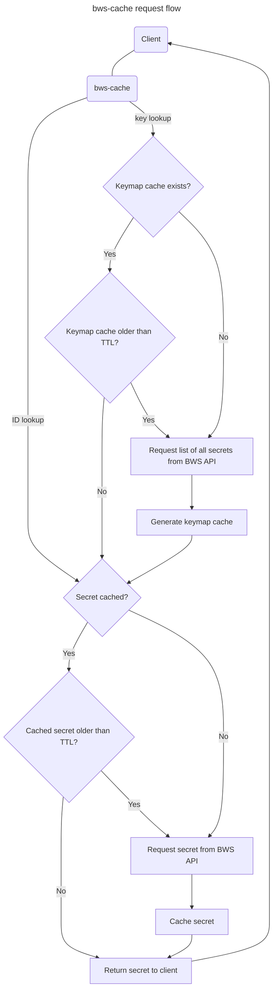

# Bitwarden Secrets Manager Cache

Python app implementing a read-through cache for Bitwarden Secrets Manager (BWS) secrets.

# Usage

When a secret is queried, not only is the secret cached in memory, but a mapping between ID and key is also cached.

This allows lookup by either ID or key, as shown below.

## Endpoints

* `/id/<string:secret_id>`
* `/key/<string:secret_key>`
* `/reset`

## Authentication

bws-cache delegates authentication to the BWS client library, rather than requiring a defined token for client authentication.

A valid BWS access token should be passed as a bearer token in the `Authorization` header, as shown in the examples below.

## Examples

Query secret by ID: `curl -H "Authorization: Bearer <BWS token>" http://localhost:5000/id/<secret_id>`

Query secret by key: `curl -H "Authorization: Bearer <BWS token>" http://localhost:5000/key/my_secret`

Invalidate the secret cache: `curl -H "Authorization: Bearer <BWS token>" http://localhost:5000/reset`

# Run

You can get your BWS organisation ID two ways:
* From BWS CLI:
  * `bws project list` / `bws project get <project_id>` - Your organisation ID is shown in the `organizationId` value of each project returned.
  * `bws secret list` / `bws secret get <secret_id>` - Your organisation ID is shown in the `organizationId` value of each secret returned.
* From browser:
  1. Go to https://vault.bitwarden.com
  2. Open Secrets Manager from the apps list in the top right
  3. Your organisation ID is in the URL like this: `https://vault.bitwarden.com/#/sm/<BWS org ID>`

Docker Run:

```
docker run \
  -p 5000:5000 \
  -e ORG_ID=<org ID> \
  ghcr.io/ripplefcl/bws-cache:latest
```

Docker Compose:

```yml
version: '3'
services:
  bwscache:
    image: ghcr.io/ripplefcl/bws-cache:latest
    environment:
      ORG_ID: <org ID>
    ports:
      - '5000:5000'
```

## Environment Variables

| Name                     | Info                                                  | Default |
|--------------------------|-------------------------------------------------------|---------|
| `ORG_ID`                 | Your BWS organisation ID.                             |         |
| `SECRET_TTL`             | TTL of cached secrets and secret ID-to-key mappings.  | `600`   |
| `DEBUG`                  | Enable debug logging.                                 | `false` |
| `REFRESH_KEYMAP_ON_MISS` | Enable refreshing of the keymap on key miss.          | `true`  |

# How It Works

When a secret is cached, it is cached in memory. Therefore, if the container is restarted, the cache is emptied. You can use the `/reset` endpoint if you wish to manually empty the cache.

Since bws-cache allows for secret lookups by key (as opposed to ID), a feature that is not yet natively available in first-party BWS clients, it also caches a map of secret ID/key pairs. We'll call this the keymap cache. The keymap cache expires just as the secret cache does, respecting `SECRET_TTL`.

Upon lookup of a secret ID that **does not** exist in cache, bws-cache will query the BWS API for the secret, store it in the cache, and return the secret object to the client.

Upon lookup of a secret ID that **does** exist in cache, bws-cache will check the timestamp of the secret's cache entry to ensure it has not expired according to `SECRET_TTL` and return the secret object to the client.
If the secret in cache has expired, bws-cache will query the BWS API for the secret, re-cache it, and return the secret object to the client.

Upon lookup of a secret key that **does not** exist in the key map cache and if `REFRESH_KEYMAP_ON_MISS` is true, bws-cache queries the BWS API for a list of every secret in the specified `ORG_ID`. It then generates and stores the keymap cache and returns the secret to the client if it exists or returns missing secret.

Upon lookup of a secret key that **does** exist in cache, bws-cache will check the timestamp of the keymap cache to ensure it has not expired according to `SECRET_TTL` and return the secret object to the client.
If the keymap cache has expired, it will first be refresh as described above, after which the secret object will be returned to the client.


